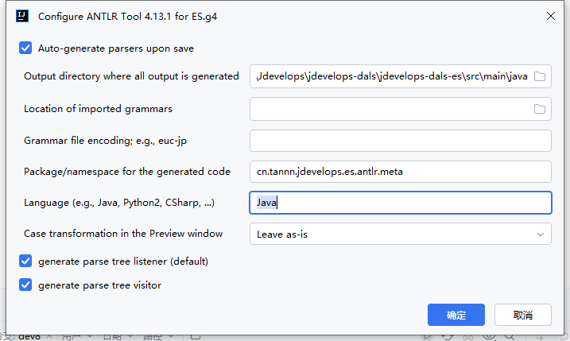

# antlr ES.g4生产目录设置
>  
选择ES.g4文件，右击选择Configure ANTLR
- output: ./src/main/java
- package: cn.tannn.jdevelops.es.antlr.meta
- language: Java

# 生成 es 代码
1. 配置好生产目录
2. 构建好 ES.g4 结构
3. 选择ES.g4文件，右击 GENERATE ANTLR Recognizer


# DSL 示例
```sql
// 基本查询
field == "value"
field != "value"
field >= "10"
field <= "20"
field > "30"
field < "40"
field += "partial"

// 正则表达式查询
field =~ "pattern.*"
field !~ "unwanted.*"

// 数组查询
field in ["value1", "value2"]
field not in ["value3", "value4"]

// 存在性查询
field exists
field not exists

// 复合查询
(field1 == "value1" and field2 in ["a", "b"]) or field3 exists


// 各种字符串格式都支持
email == test@example.com
email == "test@example.com"
email == 'test@example.com'

// 数组
emails in [test1@example.com, "test2@example.com", 'test3@example.com']

// 其他查询保持不变
name == "John"
age >= 18
status exists
tags not in ["deleted", "archived"]


```
