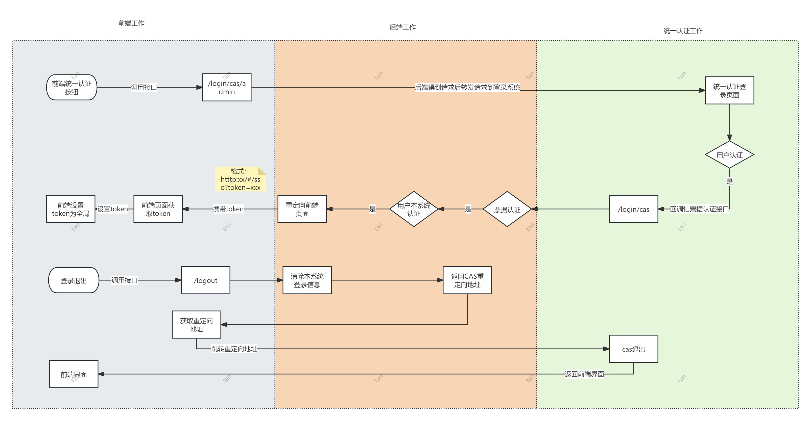

# use


```java
private final CasService casService;


/**
 * <code>
 *       handleToCAS() {
 *           window.location.href = `${process.env.VUE_APP_BASE_API}/login/cas/admin`
 *       }
 * </code>
 */
@ApiMapping(value = "/login/cas/admin", method = RequestMethod.GET, checkToken = false)
@Operation(summary = "第一步：前端统一认证登录按钮出发的请求接口", description = "统一认证")
@ApiOperationSupport(order = 1)
public void loginCasWeb(HttpServletResponse response, HttpServletRequest request) throws IOException {
    CasConfig casConfig = casService.getCasConfig();
    String loginUrl = casConfig.fullLoginUrl() + "?service=" + casConfig.jRedirect();
    response.sendRedirect(loginUrl);
}

@ApiMapping(value = "/login/cas", method = RequestMethod.GET, checkToken = false)
@Operation(summary = "第二步：统一认证成功后的跳转地址", description = "cas票据认证")
@ApiOperationSupport(order = 2)
public void loginCas(HttpServletResponse response, HttpServletRequest request, String ticket) throws IOException {
    JsonObject userJson = casService.verifyTicket(ticket);
    CasConfig casConfig = casService.getCasConfig();
    String teacherNo = userJson.get("user_no").getAsString();
    Customer customer = customerService
            .finCustomer(teacherNo)
            .orElseThrow(() -> new UserException("当前账户不支持登录本系统，请联系管理员"));
    String sign = loginUserSign(customer, request, Collections.singletonList(PlatformConstant.WEB_ADMIN), LoginType.ADMIN_ACCOUNT_CAS);
    response.sendRedirect(casConfig.vRedirect() + "?token=" + sign);
    // 设置 Cookie
//        Cookie cookie = new Cookie("cas_token", sign);
//        response.addCookie(cookie);
//        response.sendRedirect(casConfig.vRedirect());
}


/**
 * <code>
 *     <script>
 *          import { getToken } from '@/utils/auth'
 *          export default {
 *              async created() {
 *                 const { query } = this.$route
 *                  if (query.token) {
 *                      await this.$store.dispatch('user/setToken', query.token)
 *                      this.$router.replace({ path: '/' })
 *                  } else if (getToken()) {
 *                      this.$router.replace({ path: '/' })
 *                  } else {
 *                      location.href = `${process.env.VUE_APP_BASE_API}/login/cas/admin`
 *                  }
 *              },
 *          render: function(h) {
 *          return h() // avoid warning message
 *          }
 *      }
 *     </script>
 * </code>
 */
@Operation(summary = "退出")
@GetMapping("/logout")
public  ResultVO<String> logout(HttpServletResponse response, HttpServletRequest request) throws IOException {
    redisLoginService.loginOut(request);
    // 清除后端会话
    request.getSession().invalidate();
    casService.loginOut(request, response);
//        // 重定向到 CAS 的登出接口
    CasConfig casConfig = casService.getCasConfig();
    // 本地调式用的，前端判断data是否为空，空就不 location.href
    if(Boolean.TRUE.equals(casConfig.getIsRedirectLogout())){
        return ResultVO.success("退出成功",
                casConfig.fullLogoutUrl() + "?service=" + casConfig.logoutRedirect());
    }else {
        return ResultVO.successMessage("退出成功");
    }
}

```
